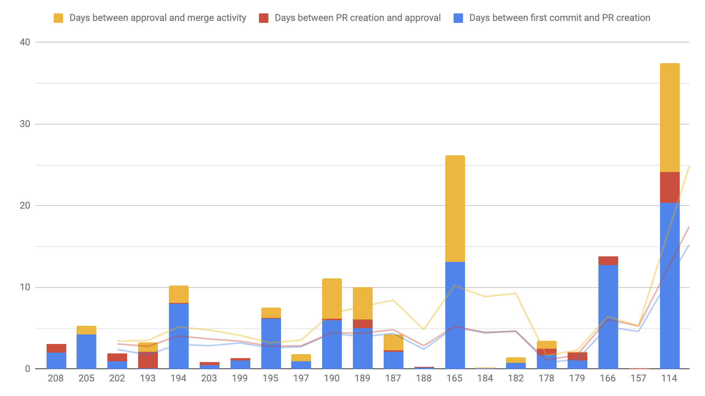

# BitBucket PR Analysis

Provides utilities to study the pull requests (PRs) merged in a Bitbucket repo.

Currently it supports using a Pearson correlation coefficient to help identify what bottlenecks a team is facing, and exporting some relevant PR data as a CSV.



This data can be leveraged by engineering teams to identify bottlenecks on their flows, measure the progress since an experiment was executed,...

## Getting Started

### Prerequisites

Software requirements:

* Android Studio or IntellijIDEA

## Running an analysis on your BitBucket repo

You can analyse a repo by running the Command-Line Interface scripts available. They will request credentials and the repository address and then run the analysis.

Current available analysis are:

* AnalyzeCorrelations.kt: Analyses the correlation between metrics. Useful to see patterns that are hard to visualise, as an example, might be the number of comments impacts your cycle time, so you should target reducing the **need** for those comments.
* ExportToCSV.kt: Exports a CSV so as to allow you to analyse as a spreadsheet.

You can also execute them by using the gradle tasks included:

```bash
./gradlew --console=plain runCSVExport
./gradlew --console=plain runCorrelations
```

### Configuring run via properties file

To avoid having to manually enter all the information on each run, the scripts support using a Java Properties file to specify the credentials and repositories to load.

To do so, create a config.properties file in the working directory, with contents similar to:

```
bitbucket.username=USERNAME
bitbucket.password=A BITBUCKET APP PASSWORD
bitbucket.repositories=repositoryUsername/repositorySlug,repositoryUsername2/repositorySlug2,...
bitbucket.pages.to.load=2
bitbucket.filter.target.branch=develop
```

This file should be located at the root of the repository when running from Android Studio, or at the `BitbucketCodeMetrics` module when running from the command line using Gradle.

### Analysing a private repo

Private repos require an app password with `Read Pull Requests` authorization in order to access them.

These credentials can be generated in the User settings section in the BitBucket page following this [guide](https://confluence.atlassian.com/bitbucket/app-passwords-828781300.html).

The `Main.kt` script will prompt at the beginning to provide your username and app passwords.

## Running the tests

Right click on the BitbucketPullRequestAnalysisTest and select run tests to execute a test on a public repo.

## How are metric correlations measured?

This software will perform two tasks to analyse your PRs.

* Downloading PR metadata using the Bitbucket v2.0 API
* Execute a Pearson product-moment correlation coefficient (PPMCC) using the [Apache commons framework](https://commons.apache.org/proper/commons-math/javadocs/api-3.3/org/apache/commons/math3/stat/correlation/PearsonsCorrelation.html)

A PPMCC is an analysis over a matrix of data of size NxM (M measures of N variables) that yields a square matrix of NxN. In the resulting matrix, each cell with index i, j defines how strongly the variables with index i and j are correlated.

### How to understand the results

As detailed above, the result of the PPMCC is a square matrix detailing how strongly the two variables correlate to each other.

After the last ~250 PRs have been analysed, the system will output a set of one line per variable analysed detailing how they correlated to the interval between the first commit and merging the PR.

The values can range from -1.0 to 1.0, where:

* 0 means the variable does not impact one way or another the time it takes to merge a PR.
* 1 means the variable impacts positively how long it takes to merge a PR (takes more time).
* -1 means the variable impacts negatively how long it takes to merge a PR (takes less time).

Therefore, if a variable is close to 1, the team should take actions to reduce that variable, as it will result in an increase in the overall throughput of it. If, on the other hand, the value is close to -1, you want to maximise that variable.

As an example, these are the results of a real repository I run the analysis on:

```
Time between first commit and approval:		0.98
Time between first commit and PR creation:		0.97
Time between approval and merge:		0.33
Merge commit count:		0.31
Number of commits:		0.20
Activity in PR:		0.15
Time between creation and approval:		0.09
Number of comments:		0.06
Number of tasks:		NaN
Using tasks:		NaN
```

Based on these numbers we can see that:

* Altough obvious, the most significant correlation to the time from first commit to merge is the time from first commit to the PR creation and approval.
* The time between approval and merge has a significant correlation.
* The number of merge commits in the PR have a significant impact in the performance of the team
* A higher activity in the PR weakly correlates in a positive manner to the time to merge.

With these results, the team of the example could benefit from considering how to reduce the time between the first commit and creating and approving a PR, how to reduce the number of merge commits to perform and the activity in the PR. An example of such activities could be to reduce the batch size, or to catchup before the start of a feature to minimise the impact of integrating branches.

## Caveats

PPMCC doesn't allow to easily compare discrete data (E.g. does the programming language impact the type?).
